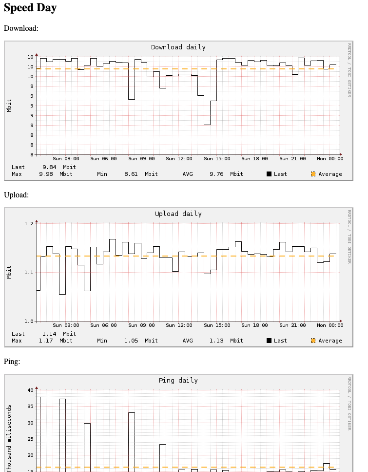

# speedtest-pi

This repo installs a speedtest that generates plots to help to check your internet speed connection.

[install.sh] (./install.sh) 
*Installation script, will install this script and check dependecies (crontab and lighttml)*
*also will add speedtest.sh to your crontab to run each 5 min.*

[index.html] (index.html)
*basic html file pointing to rrdgraph files. (will take a bit to fill the plots, takes at least 15 min)*

[speedtest-rrd.sh](speedtest-rrd.sh)
*Makes the magic happens*

## Dependencies:
- [speedtest-cli](https://www.speedtest.net/pt/apps/cli) 
- [lightppd] (https://github.com/lighttpd)
- [rrdtool] (https://github.com/oetiker/rrdtool-2.x)
- crontab

